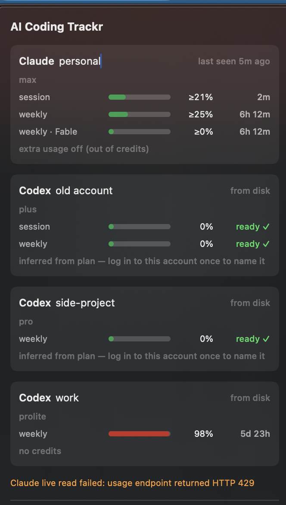

<h1 align="center">AI Coding Trackr</h1>

<p align="center">
  A macOS menu bar app that shows how much quota is left on every coding-agent
  account you use — and exactly when each one resets.
</p>

<p align="center">
  <code>CL 25%&nbsp;&nbsp;CX ✓&nbsp;&nbsp;CX ✓&nbsp;&nbsp;CX 98%</code>
</p>

<p align="center">
  No signup. No login. No account linking. Nothing leaves your machine.
</p>

<p align="center">
  
</p>

---

## Why

If you work across several Claude and Codex accounts, the question is always the
same: *which one still has quota, and when does the spent one come back?* The
answer exists on your disk already — every CLI writes it — it is just not
anywhere you can see it.

Trackr reads what is already there and puts it in your menu bar.

## Install

One command. It builds from source on your machine, so there is no Gatekeeper
warning and nothing to unquarantine.

```sh
curl -fsSL https://raw.githubusercontent.com/tawanorg/aicodingtrackr/main/install.sh | bash
```

Needs macOS 14+ and Apple's command line tools. If `swift` is missing the script
runs `xcode-select --install` for you and tells you to re-run it.

Start it automatically at login:

```sh
~/.aicodingtrackr/src/install-login-item.sh
```

<details>
<summary>Build it yourself instead</summary>

```sh
git clone https://github.com/tawanorg/aicodingtrackr.git
cd aicodingtrackr
./bundle.sh release          # -> build/Trackr.app
open build/Trackr.app

./.build/release/trackr      # same data as a text table
```
</details>

## Using it

- **Name your accounts.** Click any account name and type. `unidentified · pro`
  becomes `side-project`. Names persist across logout and login. Submit an empty
  name to clear it.
- **Read the strip.** `CL` is Claude, `CX` is Codex. A number is percent *used*;
  `✓` means that account's window has reset and it is ready.
- Trackr shows the numbers and stays out of the way. Which account to use is
  your call.

## What it reads

| Provider | Source | Network | Fidelity |
|---|---|---|---|
| Claude Code | `GET /api/oauth/usage` with the OAuth token Claude Code already stores in your login Keychain | yes | exact, live |
| Codex | `rate_limits` in `~/.codex/sessions/**/rollout-*.jsonl` | **none** | exact for the logged-in account |

Codex deliberately makes **no** network call. It exposes no read-only usage API —
rate limits only ride along on real inference responses — so probing one would
consume the very quota being measured.

## How stale data stays useful

`~/.claude.json` and `~/.codex/auth.json` each hold exactly one logged-in account
and are *overwritten* when you log into another. So at any instant only the active
account is directly readable. Naively that gives you one real number and a row of
stale guesses.

Two things fix it:

1. **An append-only snapshot store.** Every reading Trackr sees is recorded, so an
   account's last known state survives you switching away from it.
2. **Reset times are absolute, not durations.** A snapshot whose reset time has
   already passed *proves* that window rolled over — the account is back to 0%
   used. Stale data, exact conclusion.

So *"has my other account reset yet?"* is answered with certainty even if Trackr
has not seen that account in a week. Only an account still mid-window degrades,
and it says so:

| Shown | Means |
|---|---|
| `25%` | exact — read live, or provably reset |
| `≥25%` | stale mid-window snapshot; real usage can only be higher |
| `ready ✓` | window rolled over, full quota available |

## Privacy

Everything stays on your machine. The only network request is to Anthropic's own
usage endpoint, with the token Claude Code already put in your Keychain — the same
call the CLI's `/usage` command makes. There is no server, no telemetry, and no
account of ours to create.

State lives in `~/Library/Application Support/AICodingTrackr/`. Delete it to reset.

Once you name an account, the panel shows the name and plan rather than the email
address, so the window is safe to screenshot or screen-share.

## Known limits

- **It only learns accounts it has observed.** Use each account once while Trackr
  is running; it cannot retroactively discover one it has never seen. Installing
  the login item makes this happen passively.
- **Codex rollouts written before ~Sept 2026 carry no account id.** Trackr falls
  back to grouping them by plan and shows `unidentified · pro`, since a `pro`
  rollout cannot have come from a `prolite` account. Log into one of those
  accounts once and it gets a real identity. Two accounts on the same plan
  collapse into one entry — a labelled heuristic, not an identity.
- **Codex cloud tasks** (run from the ChatGPT web UI) spend the same quota but
  write no local rollout, so the local reading can understate usage.
- **`/api/oauth/usage` is unofficial** and rate-limits its callers. Trackr polls
  every 5 minutes and backs off when throttled; any failure degrades to the last
  stored snapshot rather than breaking the display.
- **Reading the Keychain prompts once.** That is a one-off macOS consent dialog,
  not a login. The bundle is ad-hoc signed with a stable identity so the grant
  survives rebuilds.
- **macOS only.** Windows is feasible — Codex writes identical rollouts under
  `%USERPROFILE%\.codex\` and Claude Code keeps credentials in a file there — but
  the UI layer needs rewriting. Tracked in [issues](https://github.com/tawanorg/aicodingtrackr/issues).

## Layout

```
Sources/TrackrCore/
  Model.swift           accounts, windows, and resolving a reading against the clock
  ClaudeProvider.swift  Keychain read + usage endpoint + backoff
  CodexProvider.swift   rollout scan, cached headers, tail-parsed rate limits
  SnapshotStore.swift   append-only history
  Nicknames.swift       user-chosen account names
  Tracker.swift         merge live + cached, order, format
Sources/trackr/         text mirror of the panel
Sources/TrackrBar/      MenuBarExtra UI
```

### Adding a provider

Yield an `AccountSnapshot` — a stable `AccountRef` plus one `QuotaWindow` per limit
with an **absolute** `resetsAt` — and merge it in `Tracker.refresh`. The staleness
and ordering logic is provider-agnostic; it only needs reset times to be absolute
rather than durations.

## License

MIT — see [LICENSE](LICENSE). Built by [@tawanorg](https://github.com/tawanorg).
